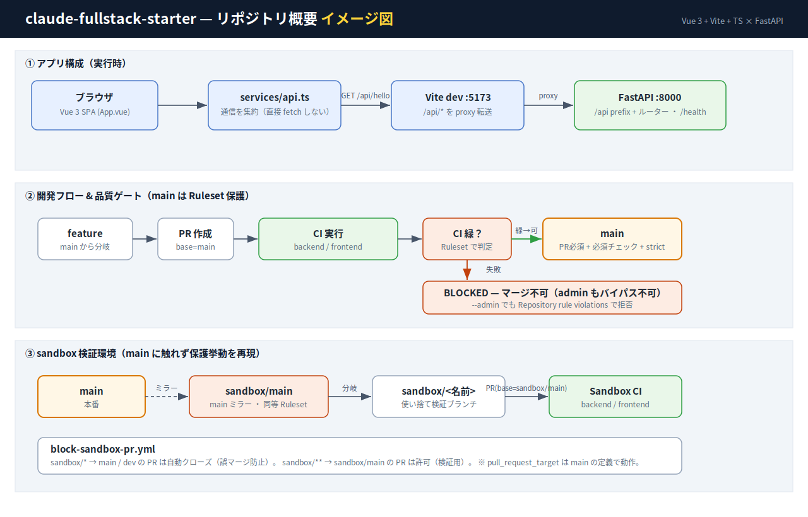

# claude-fullstack-starter

[日本語](README.md) | **English**

[](https://github.com/itouhi/claude-fullstack-starter/actions/workflows/ci.yml)
[](LICENSE)

A full-stack development template with FastAPI (Python 3.14) + Vue 3 + Vite + TypeScript.
It ships with a VSCode Dev Container, CI via GitHub Actions, branch protection (Rulesets), Claude Code skills, and development-process documentation.



> See [`docs/`](docs/README.en.md) for structure and process details ([architecture](docs/architecture.en.md) / [development-process](docs/development-process.en.md)).

## Features

- **Backend**: FastAPI / Pydantic / pytest / ruff
- **Frontend**: Vue 3 (Composition API + `<script setup lang="ts">`) / Vite / TypeScript / ESLint
- **Environment**: Boots instantly in a VSCode Dev Container
- **CI**: Runs backend / frontend quality checks on every PR
- **Branch protection**: Rulesets enforce "merge to `main` only when CI is green"
- **Claude Code skills**: Scaffolding from adding APIs/components to docs and CI

## Directory layout

```
.
├── .devcontainer/        # VSCode Dev Container config
├── .claude/skills/       # Claude Code project skills
├── .github/workflows/    # CI / branch protection / sandbox CI
├── docs/                 # Structure & development-process diagrams
├── backend/              # FastAPI application
│   ├── app/
│   │   ├── api/          # Routers (aggregated in __init__.py)
│   │   ├── config.py
│   │   └── main.py
│   ├── tests/
│   └── pyproject.toml
└── frontend/             # Vue 3 + Vite + TS
    ├── src/
    │   ├── services/     # API calls are centralized here
    │   ├── App.vue
    │   └── main.ts
    └── package.json
```

## Using this template

```bash
# Clone and start your own project
git clone https://github.com/itouhi/claude-fullstack-starter.git myapp
cd myapp
rm -rf .git && git init -b main && git add -A && git commit -m "Initial commit"

# Publish to your own GitHub repo (gh CLI is bundled in the dev container)
gh repo create <your-account>/myapp --private --source=. --remote=origin --push
```

## Getting started

### 1. Open the Dev Container

Open this repository in VSCode and run **"Dev Containers: Reopen in Container"** from the command palette.
`.devcontainer/post-create.sh` creates the backend venv + installs dependencies and runs `npm install` for the frontend.

### 2. Start the backend

```bash
cd backend
source .venv/bin/activate
uvicorn app.main:app --reload --host 0.0.0.0
```

Swagger UI is available at `http://localhost:8000/docs`.

### 3. Start the frontend (separate terminal)

```bash
cd frontend
npm run dev -- --host
```

Open `http://localhost:5173`. Requests to `/api/*` are forwarded to the backend (8000) through the Vite proxy.

## Development commands

### backend
```bash
pytest -q              # tests
ruff check .           # lint
ruff format .          # format
```

### frontend
```bash
npm run dev            # dev server
npm run build          # production build
npm run type-check     # type check
npm run lint           # ESLint
npm run format         # Prettier
```

## Claude Code skills

The following project-specific skills live under `.claude/skills/`:

- **add-api-endpoint** — Scaffold a FastAPI endpoint
- **add-vue-component** — Add a Vue 3 SFC (Composition API + TS)
- **add-fullstack-feature** — Add backend → frontend service → component end to end
- **write-dev-docs** — Create development-process docs (requirements → release) under `docs/<feature>/`
- **push-changes** — Split changes into per-concern commits and push together
- **run-dev-cycle** — Semi-automatically drive a feature through the process (docs + impl + tests)
- **verifier-webapp** — Verify UI/API in a real browser (Playwright)
- **coding-standards** — Naming, doc comments, and formatting rules (enforced by ruff D / eslint naming)
- **compose-service** — Bundle features into one service (vue-router App Shell + BFF aggregation)
- **setup-ci** — Automate quality checks and dependency audits with GitHub Actions
- **add-persistence** — Move from in-memory to a real DB (SQLModel + Alembic migrations)
- **add-frontend-test** — Add unit tests with Vitest + Testing Library
- **add-auth** — Full JWT + RBAC authentication/authorization
- **add-store** — Frontend state management (Pinia)
- **add-observability** — Structured logs, production-safe error handling, metrics
- **add-e2e-test** — Automated E2E with Playwright (regression)
- **audit-deps** — Dependency vulnerability audit (npm audit / pip-audit)

See each `SKILL.md` and [CLAUDE.md](CLAUDE.md) for details.

## Branch workflow & quality gate

- Branch off `main` (release) with `feat/*` `fix/*` `docs/*` `ci/*` work branches and open a PR.
- `main` is **protected by Rulesets**: PR required + required checks (`backend` / `frontend`) + strict (up to date), no bypass (admins cannot merge either). **You can only merge when CI is green.**
- **CI workflows** (`.github/workflows/`):
  - `ci.yml` — quality checks for `main`
  - `sandbox-ci.yml` — CI for `sandbox/**`
  - `block-sandbox-pr.yml` — auto-closes `sandbox/*` → `main` PRs (prevents accidental merges). `sandbox/**` → `sandbox/main` is allowed.
- `sandbox/main` mirrors `main` as the base for sandbox verification with the same protection. Cut throwaway `sandbox/<name>` branches to try protection behavior without touching production.

See [docs/development-process.en.md](docs/development-process.en.md) for details.

## License

Released under the [MIT License](LICENSE).

This repository was built with the assistance of [Claude Code](https://www.anthropic.com/claude-code).
