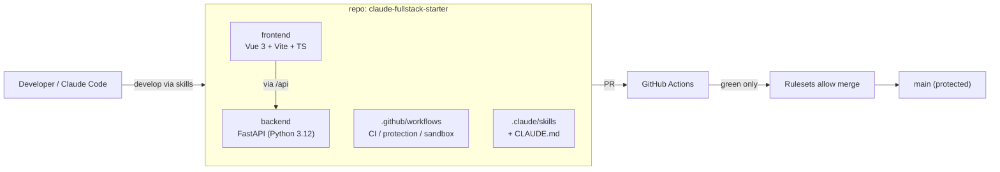

# Project documentation

[日本語](README.md) | **English**

Diagrams of this repository's **structure** and **development process**.

## Contents

| Doc | Topics |
|---|---|
| [architecture.en.md](./architecture.en.md) | Repository structure, tech stack, request flow |
| [development-process.en.md](./development-process.en.md) | Branch strategy, CI/CD, branch protection (Rulesets), sandbox verification, skill-based flow |
| [rulesets-setup.en.md](./rulesets-setup.en.md) | How to configure branch protection (Rulesets) (UI / gh CLI) |

## Big picture

- **backend** — FastAPI; returns JSON under `/api/*` ([architecture.en.md](./architecture.en.md)).
- **frontend** — Vue 3 SFC; the Vite dev proxy forwards `/api` to the backend.
- **Quality gate** — CI (`backend` / `frontend`) runs on every PR; merging into main / sandbox/main is allowed **only when green** ([development-process.en.md](./development-process.en.md)).
- **How to develop** — Follow the skills under `.claude/skills/` and the conventions in `CLAUDE.md`.

> Diagrams render as Mermaid on GitHub.
