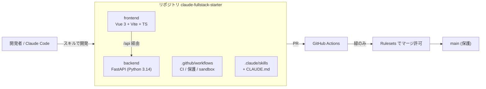

# プロジェクトドキュメント

**日本語** | [English](README.en.md)

このリポジトリの **構造** と **開発プロセス** を図解する資料群です。

## 目次

| 資料 | 内容 |
|---|---|
| [architecture.md](./architecture.md) | リポジトリ構造・技術スタック・リクエストの流れ |
| [development-process.md](./development-process.md) | ブランチ戦略・CI/CD・ブランチ保護 (Rulesets)・sandbox 検証・スキル開発フロー |
| [rulesets-setup.md](./rulesets-setup.md) | ブランチ保護 (Rulesets) の設定手順 (UI / gh CLI) |

## 全体像

- **backend** — FastAPI。`/api/*` で JSON を返す ([architecture.md](./architecture.md))。
- **frontend** — Vue 3 SFC。Vite の dev proxy で `/api` を backend に転送。
- **品質ゲート** — PR ごとに CI (`backend` / `frontend`) を実行し、**緑のときだけ** main / sandbox/main にマージできる ([development-process.md](./development-process.md))。
- **開発の進め方** — `.claude/skills/` のスキルと `CLAUDE.md` の規約に沿って進める。

> 図は GitHub 上で Mermaid として描画されます。
