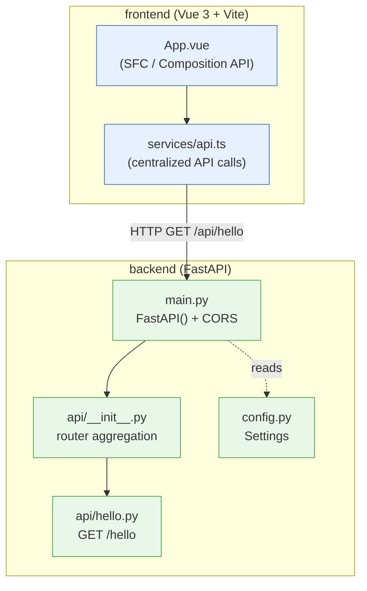
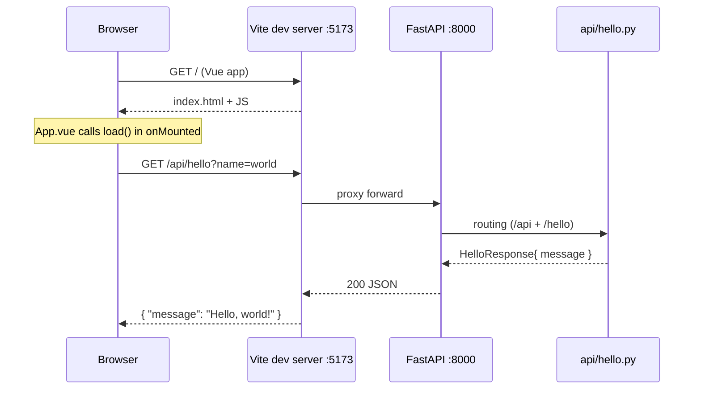

# Architecture / repository structure

[日本語](architecture.md) | **English**

FastAPI (backend) and Vue 3 (frontend) live in a single repository. Development happens inside a VSCode Dev Container.

## Tech stack

| Layer | Tech |
|---|---|
| Backend | FastAPI / Python 3.14 / Pydantic / pytest / ruff |
| Frontend | Vue 3 (Composition API + `<script setup>`) / Vite / TypeScript / ESLint |
| Environment | VSCode Dev Container (Ubuntu) |
| CI | GitHub Actions (ruff / pytest / eslint / type-check) |

## Directory structure

```
.
├── .devcontainer/             # Dev Container config
├── .claude/skills/            # Claude Code project skills
├── .github/workflows/         # CI / branch protection / sandbox CI
│   ├── ci.yml                 # CI for main (backend/frontend)
│   ├── sandbox-ci.yml         # CI for sandbox/**
│   └── block-sandbox-pr.yml   # auto-close sandbox/* -> main PRs
├── backend/
│   ├── app/
│   │   ├── api/               # routers (aggregated in __init__.py)
│   │   │   └── hello.py
│   │   ├── config.py          # settings (BaseSettings)
│   │   └── main.py            # FastAPI entry point
│   ├── tests/                 # pytest
│   └── pyproject.toml         # deps & ruff config (single source)
├── frontend/
│   ├── src/
│   │   ├── services/          # API calls centralized (api.ts)
│   │   ├── App.vue
│   │   └── main.ts            # Vue entry point
│   └── package.json
├── docs/                      # this documentation
├── CLAUDE.md                  # project conventions / skill system
└── README.md
```

## Component layout



### Design rules (from CLAUDE.md)

- **backend**: Routers do not add the `/api` prefix (applied centrally in `main.py`). Every router specifies `response_model`. Type hints are required.
- **frontend**: API calls are centralized in `src/services/`; components never call `fetch` directly. Use Composition API + `<script setup lang="ts">` consistently.

## Request flow

During development the Vite dev server (5173) proxies `/api/*` to the backend (8000).



- The frontend always goes through `fetchHello()` in `services/api.ts`.
- The backend serves `GET /api/hello` via the `/api` prefix (`main.py`) plus the router's `/hello`.
- `/health` is a health-check endpoint.

## Running (overview)

```bash
# backend
cd backend && source .venv/bin/activate && uvicorn app.main:app --reload --host 0.0.0.0
# frontend (separate terminal)
cd frontend && npm run dev -- --host
```

See the repository-root [README.en.md](../README.en.md) for details.
