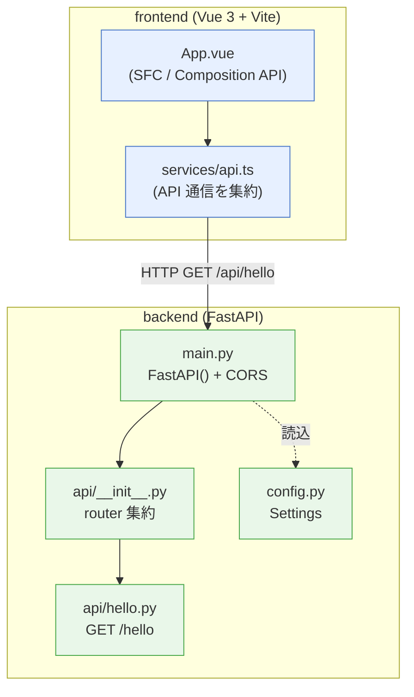
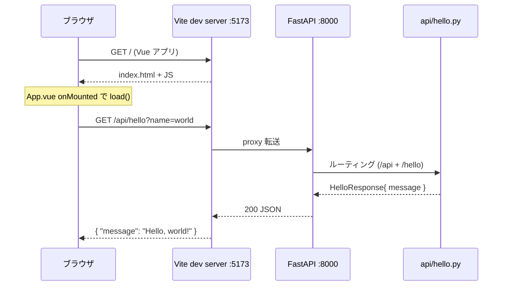

# アーキテクチャ / リポジトリ構造

**日本語** | [English](architecture.en.md)

FastAPI (backend) と Vue 3 (frontend) を 1 リポジトリで管理する構成です。開発は VSCode Dev Container 上で行います。

## 技術スタック

| レイヤ | 技術 |
|---|---|
| Backend | FastAPI / Python 3.14 / Pydantic / pytest / ruff |
| Frontend | Vue 3 (Composition API + `<script setup>`) / Vite / TypeScript / ESLint |
| 環境 | VSCode Dev Container (Ubuntu) |
| CI | GitHub Actions (ruff / pytest / eslint / type-check) |

## ディレクトリ構造

```
.
├── .devcontainer/             # Dev Container 設定
├── .claude/skills/            # Claude Code 用プロジェクトスキル
├── .github/workflows/         # CI・ブランチ保護・sandbox CI
│   ├── ci.yml                 # main 用 CI (backend/frontend)
│   ├── sandbox-ci.yml         # sandbox/** 用 CI
│   └── block-sandbox-pr.yml   # sandbox/* -> main の PR を自動クローズ
├── backend/
│   ├── app/
│   │   ├── api/               # ルーター (__init__.py で集約)
│   │   │   └── hello.py
│   │   ├── config.py          # 設定 (BaseSettings)
│   │   └── main.py            # FastAPI エントリポイント
│   ├── tests/                 # pytest
│   └── pyproject.toml         # 依存・ruff 設定 (一元管理)
├── frontend/
│   ├── src/
│   │   ├── services/          # API 通信を集約 (api.ts)
│   │   ├── App.vue
│   │   └── main.ts            # Vue エントリポイント
│   └── package.json
├── docs/                      # 本ドキュメント
├── CLAUDE.md                  # プロジェクト規約 / スキル体系
└── README.md
```

## コンポーネント構成



### 設計ルール (CLAUDE.md より)

- **backend**: ルーターに `/api` prefix を付けない (`main.py` で一括付与)。全ルーターに `response_model` を指定。型ヒント必須。
- **frontend**: API 通信は `src/services/` に集約し、コンポーネントから直接 `fetch` しない。Composition API + `<script setup lang="ts">` で統一。

## リクエストの流れ

開発時は Vite の dev server (5173) が `/api/*` を backend (8000) にプロキシします。



- フロントは必ず `services/api.ts` の `fetchHello()` を経由します。
- backend は `/api` prefix (`main.py`) + ルーター側の `/hello` で `GET /api/hello` を提供します。
- `/health` はヘルスチェック用エンドポイントです。

## 起動方法 (概要)

```bash
# backend
cd backend && source .venv/bin/activate && uvicorn app.main:app --reload --host 0.0.0.0
# frontend (別ターミナル)
cd frontend && npm run dev -- --host
```

詳細はリポジトリ直下の [README.md](../README.md) を参照してください。
