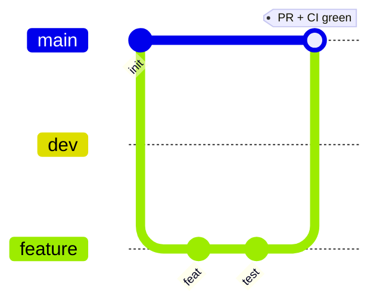
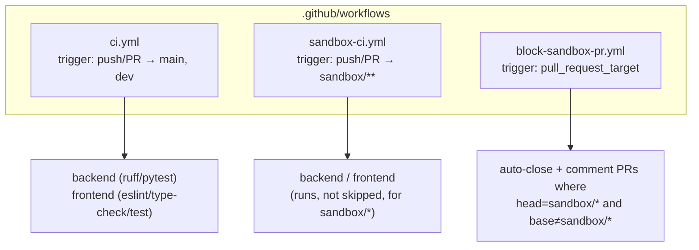
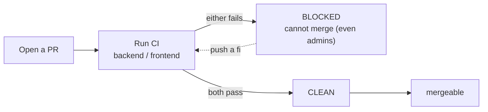
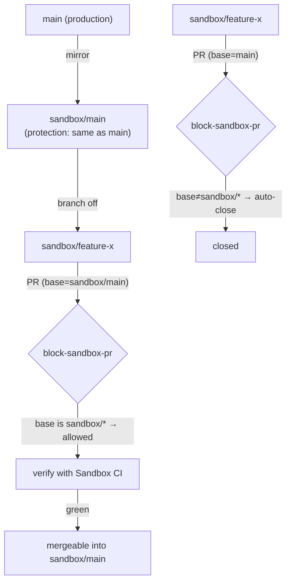
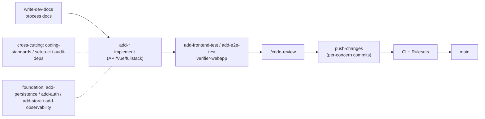
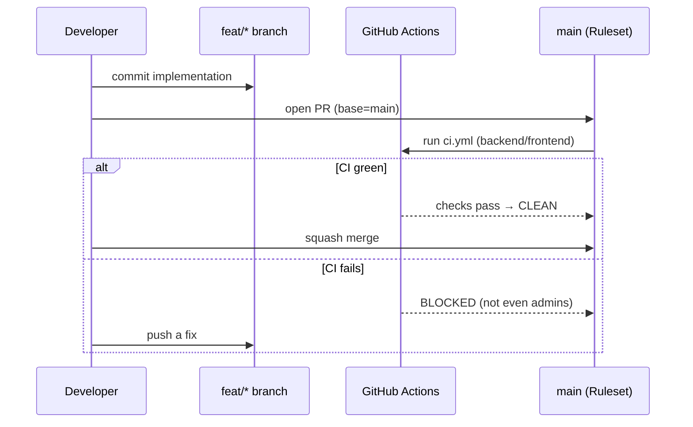

# Development process

[日本語](development-process.md) | **English**

This document covers the skill-based implementation flow combined with CI, branch protection (Rulesets), and the sandbox verification environment.

## 1. Branch strategy

| Branch | Role | Protection |
|---|---|---|
| `main` | Release target. Always green | ✅ Ruleset (PR required + CI required) |
| `dev` | Integration branch | CI target (push/PR) |
| `feat/*` `fix/*` `docs/*` `ci/*` | Per feature/fix work branches | PR into main/dev |
| `sandbox/main` | Base for sandbox verification (mirror of main) | ✅ Ruleset (same as main) |
| `sandbox/<name>` | Throwaway verification branch | — |

> Cut `feature` off `main`, implement, and merge into `main` once CI is green. `dev` is the integration branch; promotion into `main` always goes through a PR.

> **Naming constraint**: Due to git's ref rules, a plain `sandbox` branch and `sandbox/*` cannot coexist. Therefore all sandbox branches use the `sandbox/<name>` hierarchy.

## 2. CI workflows

Three workflows divide the responsibilities.

- **`ci.yml`** — For `main` / `dev`. Runs `backend` and `frontend` quality checks. Vitest uses `npm run test --if-present`, so branches without tests do not fail.
- **`sandbox-ci.yml`** — For `sandbox/**`. The main CI skips sandbox, so this runs CI in sandbox environments too. It also lives on `main`, so sandbox branches cut from main inherit it.
- **`block-sandbox-pr.yml`** — Prevents merging sandbox branches.

> **Important behavior**: A `pull_request_target` workflow definition is taken from the **default branch (main)**. So the logic that controls sandbox→main must live on `main`.

## 3. Branch protection (Rulesets)

Protection is consolidated into the **modern Rulesets** instead of classic branch protection. The same rules apply to `main` and `sandbox/main`.

| Rule | Setting |
|---|---|
| Require a pull request | ✅ (0 approvals) |
| Require status checks | `backend`, `frontend` |
| Strict (must be up to date) | ✅ |
| Block force push / deletion | ✅ |
| Bypass actors | **none (admins cannot bypass either)** |

- While CI is failing, `mergeStateStatus = BLOCKED`, and even `--admin` force-merge is rejected with `Repository rule violations found`.
- Once CI turns green it becomes `CLEAN` and can be merged.

## 4. Sandbox verification environment

This lets you try changes to `main`'s protection or workflows **without touching production main**. Because `sandbox/main` has the same Ruleset as main, it reproduces the protection behavior exactly.

- PRs `sandbox/** → sandbox/main` are **allowed** (for verification).
- PRs `sandbox/* → main` / `→ dev` are **auto-closed** (to prevent accidental merges).

## 5. Skill-based development flow

Use the skills defined in `CLAUDE.md` to move from requirements to release in stages.

- **build** (one feature) — `add-api-endpoint` / `add-vue-component` / `add-fullstack-feature`
- **drive through** — `run-dev-cycle` runs requirements→tests as gated doc→build→review→verify→push
- **make a service** — `compose-service` bundles features into an App Shell + BFF
- **cross-cutting / foundation** — `coding-standards`・`setup-ci`・`audit-deps` / `add-persistence`・`add-auth`・`add-store`・`add-observability`

See [CLAUDE.md](../CLAUDE.md) for the full skill system.

## 6. Typical workflow

1. Cut a work branch off `main` / `dev` (do not use the `sandbox/` prefix).
2. Implement and commit per concern with `push-changes`.
3. Open a PR → cannot merge until CI (`backend` / `frontend`) is green.
4. Merge once green. The Ruleset enforces PR + required CI for `main`.
