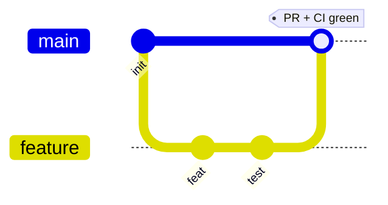
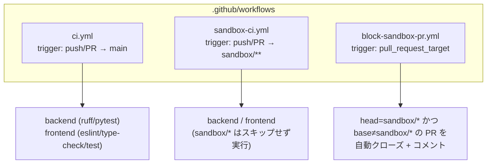
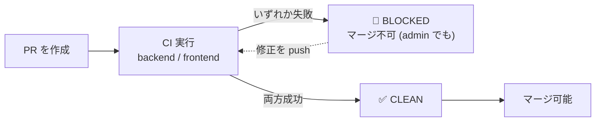
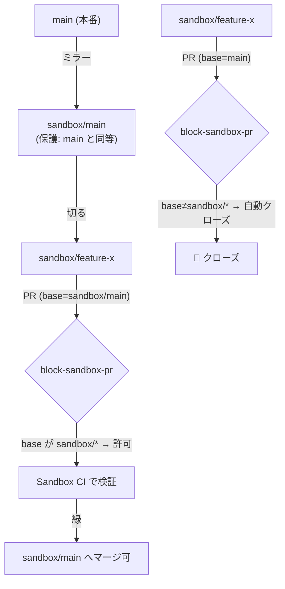
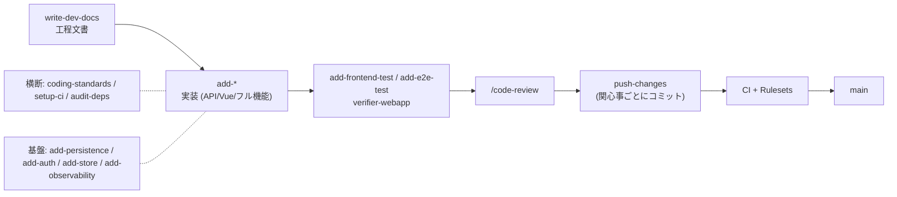
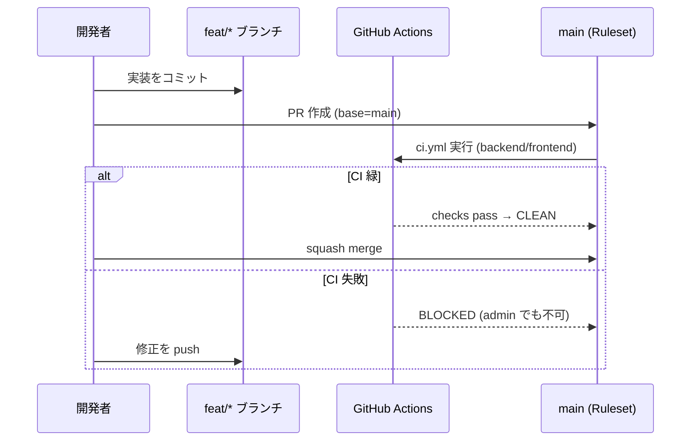

# 開発プロセス

**日本語** | [English](development-process.en.md)

スキルベースの実装フローと、CI・ブランチ保護 (Rulesets)・sandbox 検証環境を組み合わせた開発プロセスをまとめます。

## 1. ブランチ戦略

| ブランチ | 役割 | 保護 |
|---|---|---|
| `main` | リリース対象。常にグリーン | ✅ Ruleset (PR必須 + CI必須) |
| `feat/*` `fix/*` `docs/*` `ci/*` | 機能/修正単位の作業ブランチ | PR で main へ |
| `sandbox/main` | sandbox 検証の基点 (main ミラー) | ✅ Ruleset (main と同等) |
| `sandbox/<名前>` | 使い捨ての検証ブランチ | — |

> `feature` を `main` から切って実装し、CI 緑で `main` へマージします。`main` への取り込みは PR 経由で行います。

> **命名規約の制約**: git の参照仕様上、`sandbox` 単体ブランチと `sandbox/*` は共存できません。そのため sandbox 系はすべて `sandbox/<名前>` の階層に統一しています。

## 2. CI ワークフロー

3 つのワークフローが役割分担します。

- **`ci.yml`** — `main` 向け。`backend` と `frontend` の品質チェックを実行。Vitest は `npm run test --if-present` でテスト未導入ブランチでも落ちない。
- **`sandbox-ci.yml`** — `sandbox/**` 向け。本体 CI は sandbox をスキップするため、sandbox 環境でも CI を回せるよう別途用意。`main` にも配置済みで、main から切った sandbox ブランチが自動継承する。
- **`block-sandbox-pr.yml`** — `sandbox/*` の取り込み防止。

> **重要な挙動**: `pull_request_target` のワークフロー定義は **デフォルトブランチ (main) のもの** が使われます。そのため sandbox→main を制御するロジックは main 側に置く必要があります。

## 3. ブランチ保護 (Rulesets)

旧来の classic branch protection から **新しい Rulesets** に一本化しています。`main` と `sandbox/main` に同等のルールを適用。

| ルール | 設定 |
|---|---|
| Require a pull request | ✅ (承認 0) |
| Require status checks | `backend`, `frontend` |
| Strict (最新取込必須) | ✅ |
| Block force push / deletion | ✅ |
| Bypass actors | **なし (admin もバイパス不可)** |

- CI が失敗している間は `mergeStateStatus = BLOCKED` となり、`--admin` 強制マージも `Repository rule violations found` で拒否されます。
- CI が緑になると `CLEAN` に変わり、マージできます。

## 4. sandbox 検証環境

`main` の保護やワークフロー変更を **本番の main に触れずに試す** ための環境です。`sandbox/main` には main と同じ Ruleset を適用しているため、保護挙動をそのまま再現できます。

- `sandbox/** → sandbox/main` の PR は **許可** (検証用)。
- `sandbox/* → main` の PR は **自動クローズ** (誤マージ防止)。

## 5. スキルベース開発フロー

`CLAUDE.md` に定義されたスキルで、要求からリリースまでを段階的に進めます。

- **build** (1機能) — `add-api-endpoint` / `add-vue-component` / `add-fullstack-feature`
- **通す** — `run-dev-cycle` が要求〜テストを doc→build→review→verify→push でゲート付き実行
- **サービス化** — `compose-service` が複数機能を App Shell + BFF に束ねる
- **横断/基盤** — `coding-standards`・`setup-ci`・`audit-deps` / `add-persistence`・`add-auth`・`add-store`・`add-observability`

スキル体系の詳細は [CLAUDE.md](../CLAUDE.md) を参照してください。

## 6. 典型的な作業の流れ

1. `main` から作業ブランチを切る (`sandbox/` 接頭辞は使わない)。
2. 実装し、`push-changes` で関心事ごとにコミット。
3. PR を作成 → CI (`backend` / `frontend`) が緑になるまでマージ不可。
4. 緑になったらマージ。`main` へは PR + CI 必須が Ruleset で強制される。
